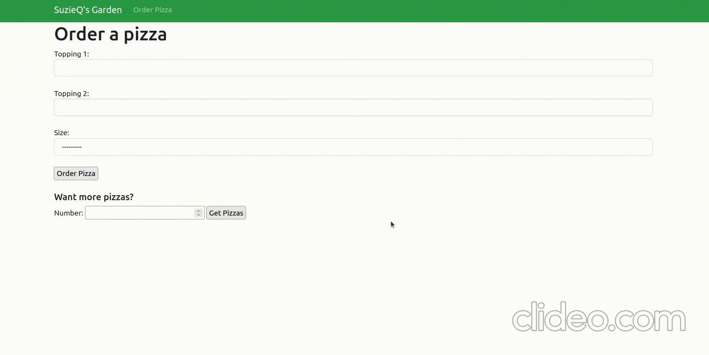

## SuzieQ's Garden | pizza ordering webapp
This project leverages Django to create forms from scratch. Other learning objectives are as follows:

- Creating form fields
- Using submitted data
- Adding models
- Using the ModelForms class
- Working with widgets
- Accepting files and multiple forms on a page
- Customizing formsets
- Using local validation
- Delivering errors responsibly
- Customizing forms
- Styling with CSS

### Dependencies 
```
python -m pip install Django
pip install django-widget-tweaks
bootstrap 5
```

### Working Demo

#### Single Order using `forms.ModelForm`


#### Multiple Orders using `forms.Form`
